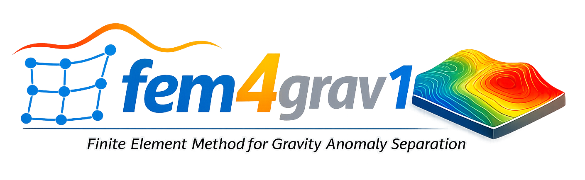
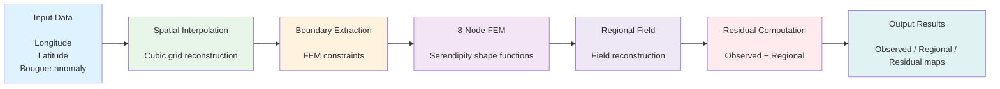

| **Project** | **Documentation** | **Build Status** | **Code Quality** | **Coverage** |
|:-----------:|:-----------------:|:----------------:|:----------------:|:------------:|
| **fem4grav** | [](https://fem4grav1.readthedocs.io/en/latest/?badge=latest) | [](https://github.com/TagniAyissi/fem4grav1/actions/workflows/python.yml) | [](https://app.codacy.com/gh/TagniAyissi/fem4grav1/dashboard?utm_source=gh&utm_medium=referral&utm_content=&utm_campaign=Badge_grade) | [](https://codecov.io/github/TagniAyissi/fem4grav1) |

<br>

<p align="left">
  <a href="https://github.com/TagniAyissi/fem4grav1/pulls"></a>
  <a href="https://github.com/TagniAyissi/fem4grav1/issues"></a>
</p>

<p align="left">
  <a href="https://github.com/TagniAyissi/fem4grav1/stargazers"></a>
  <a href="https://github.com/TagniAyissi/fem4grav1/watchers"></a>
</p>

<p align="left">
  
</p>

# fem4grav v0.0.1

## Table of Contents
- [Overview](#overview)
- [Theory](#theory)
- [Workflow](#workflow)
- [Installation](#installation)
- [Usage](#usage)
- [Tests](#tests)
- [Contributing](#contributing)
- [License](#license)

## Overview

**fem4grav** is a geophysical processing tool designed for the regional-residual separation of gravity anomalies. Based on the Finite Element Method (FEM) using 8-node serendipity elements, this package allows for the isolation of local anomalies of geological interest from regional gravity data.


## Theory

The Bouguer anomaly observed in the field is the sum of two components:

> **Observed Anomaly = Regional Anomaly + Residual Anomaly**

- **The regional anomaly** is a long-wavelength background field caused by deep geological structures.
- **The residual anomaly** is a short-wavelength signal (local signal), often caused by shallow, superficial geological structures of direct interest for exploration.

The regional field is estimated through interpolation of boundary conditions using eight-node serendipity finite elements. The residual anomaly is then obtained by simple subtraction of this regional field from the observed Bouguer anomaly.

## Workflow




## Installation

**Python version supported:** 

To install the project and all required dependencies (`numpy`, `scipy`, `matplotlib`), navigate to the root of the repository and run the appropriate command for your operating system:

**With Make (Linux / macOS)**
```bash
make install
```
**For Windows users (or alternative developer mode)**
```bash
pip install -e .[dev]
```
## Usage

To run the calculation on the provided Campi Flegrei dataset:

**Automated method (Linux / macOS)**
```bash
make run
```
This will automatically create the `results/` directory, execute fem4grav on the Flegrei.txt data, and save all generated maps into the `images/` folder.

**Command Line method (Windows / Any OS)**

If you want to apply fem4grav to your own Bouguer anomaly text files, you can use the direct CLI command. Your text file must contain exactly three columns (Longitude, Latitude, Anomaly).
Ensure that the destination folders (`results/` and `images/`) exist before running the command, or create them manually.

Example of a manual execution:
```bash
fem4grav data/Flegrei.txt --irow 101 --icol 101 --output results/flegrei.npz --table results/flegrei_table.txt --save-plot images/flegrei_maps.png
```
**To view all available options and help**
```bash
fem4grav --help
```

**Execution with Snakemake**

To automate your calculations and easily reproduce them when modifying a parameter, you can use the Snakemake workflow manager.

**Step A:** Install Snakemake:
```bash
pip install snakemake
```
**Step B:** Modify the project parameters by opening and editing the [config.yaml](https://github.com/TagniAyissi/fem4grav1/blob/main/config.yaml) file.

**Step C:** Launch the automated analysis pipeline with a specified number of CPU cores:

```bash
snakemake --cores 1
```
## Tests

To verify that the installation was successful and the computations are accurate, run the unit test suite:

**For Linux / macOS users**
```bash
make test
```
**For Windows users**
```bash
python -m pytest tests/ -v --cov=fem4grav --cov-report=term-missing
```

## Contributing

The project is open to contributions and suggestions, Just fill an issue or a pull request.
## License

The `fem4grav` package is licensed under the MIT [License](https://github.com/TagniAyissi/fem4grav1/blob/main/LICENSE).